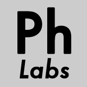



<body id="phlabsbody_about"> 

		

	
 

		

		

			

				
				
Ph Labs is an independent creative agency that specializes in user experience design and digital media.
  

Its projects include individual and organizational websites, blogs, digital image editing and archiving, and digital media museum displays.

In addition, recent projects include user experience research in the design and development processes.
  

See the <a href="phlabsprojects.php">Projects</a> and <a href="phlabscommunity.php">Community</a> pages for details.

 	

				
CONTACT <a href="mailto:phoebe.france@gmail.com">phoebe.france@gmail.com</a>

						
			
<!-- end content_inner -->
		
<!-- end content -->
	
<!-- end wrapper -->
</body>

